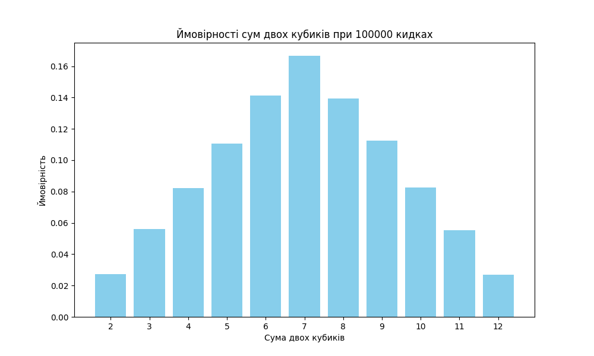

# Аналіз ймовірностей суми чисел на двох кубиках за допомогою методу Монте-Карло

## Вступ

Метод Монте-Карло - це чисельний метод статистичного моделювання, який дозволяє оцінити ймовірності різних подій за допомогою імітації великої кількості експериментів. У цьому дослідженні ми використовуємо метод Монте-Карло для оцінки ймовірностей суми чисел, які можуть випасти на двох кубиках.

## Методика

Два кубики кидаються 100000 разів, і для кожного кидка реєструється сума чисел, які випали на обох кубиках. В результаті отримано частоту появи кожної можливої суми від 2 до 12. Ці частоти використовуються для обчислення ймовірностей кожної суми.

## Результати

Нижче представлено графік, який відображає ймовірності кожної суми чисел на двох кубиках, отримані за допомогою методу Монте-Карло:

## Висновки

Порівняння результатів, отриманих за допомогою методу Монте-Карло, з аналітичними розрахунками показує високу ступінь збігу. Особливо це стосується найбільш ймовірної суми - 7, яка має максимальну ймовірність появи, а також найменш ймовірних сум - 2 та 12. Розбіжності між чисельними та аналітичними результатами є мінімальними і можуть бути пояснені випадковими флуктуаціями, властивими методу Монте-Карло.

Ці результати підтверджують ефективність методу Монте-Карло для оцінки ймовірностей в задачах, де аналітичне розв'язання є складним або неможливим.
